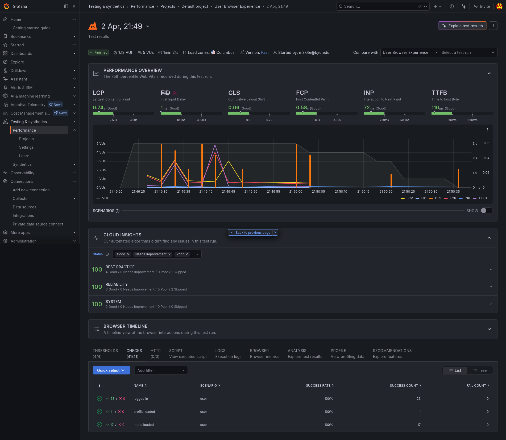

# k6 Browser testing

## Why I chose this
I chose this topic because I originally wanted to dive deeper into the different things you can do in the HAR-based tests since we were able to fail the tests when even one http request failed. But looking into it, I found the k6 browser testing and thought that sounded more interesting since I thought it would be cool to get more metrics on a different side of our website.

## Overview
The k6 browser testing suit is actually very simple to use. You set up your tests exactly as you would like the HAR file set up except you use playwright code and Grafana's `browser` module. The flow of the testing is a little different from playwright tests though. Grafana is still testing load, so instead of testing one feature like a playwright test does, you set up a flow as if you were simulating a user and Grafana is going to create a bunch of users to test how well your front end works under load. <br>

#### What k6 browser actually does:
- Opens a real browser
- Executes JavaScript
-Interacts with the page
- Clicks buttons and fills forms
This allows Grafana to simulate a real users interaction with the website while executing front end code and measure the rendering of the DOM.

## My Exploration
It took me a while to understand the true use case for this technology. I kept thinking about it as if it were still playwright, but it is just using the same syntax to perform load testing for a different part of your website. So it took me a while to set up the tests as a flow because of this misunderstanding. I eventually settled on setting up helper functions that perform a certain action such as `login`, `oderPizza`, and `viewProfile`. To better simulate a user I made another helper function choose a random action after logging in since a user probably wouldn't go to every page of the website but would perform one action.

## My Test

```
import { check } from 'k6';  
import { expect } from 'https://jslib.k6.io/k6-testing/0.6.1/index.js';  
import { browser } from 'k6/browser';  

export const options = {  
  thresholds: {  
    'browser_web_vital_lcp': ['p(75)<2500'],  
    'browser_web_vital_fcp': ['p(75)<1800'],  
    'browser_web_vital_ttfb': ['p(75)<800'],  
    'browser_http_req_duration': ['p(95)<3000'],  
  },  
  scenarios: {  
    user: {  
      exec: 'user',  
      vus: 5,
      iterations: 25,
      executor: 'shared-iterations',  
      options: { browser: { type: 'chromium' } },  
    },  
  },  
};  

export async function user() {  
  const page = await browser.newPage();  
  try {  
    await login(page);
    const action = pickAction();  
    await action(page);
  } finally {  
    await page.close();  
  }  
}  

async function login(page) {  
  await page.goto('http://pizza.maguireellsworthpizza.click');  
  await page.getByRole('link', { name: 'Login' }).click();  
  await page.getByRole('textbox', { name: 'Email address' }).fill('d@jwt.com');  
  await page.getByRole('textbox', { name: 'Password' }).fill('diner');  
  await page.getByRole('button', { name: 'Login' }).click();  
  check(page, { 'logged in': (p) => p.url().includes('pizza') });
}  

async function browseMenu(page) {  
  await page.getByRole('button', { name: 'Order now' }).click();  
  await expect(page.locator('h2')).toContainText('Awesome is a click away');  
  check(page, { 'menu loaded': (p) => p.url() !== null });  
}  

async function orderPizza(page) {  
  await page.getByRole('button', { name: 'Order now' }).click();  
  await expect(page.locator('h2')).toContainText('Awesome is a click away');  
  await page.getByRole('combobox').selectOption('1');  
  await page.getByRole('link', { name: 'Image Description Veggie A' }).click();  
  await page.getByRole('link', { name: 'Image Description Pepperoni' }).click();  
  await expect(page.locator('form')).toContainText('Selected pizzas: 2');  
  await page.getByRole('button', { name: 'Checkout' }).click();  
  await expect(page.getByRole('main')).toContainText('Send me those 2 pizzas right now!');  
  await page.getByRole('button', { name: 'Pay now' }).click();  
  await expect(page.getByRole('main')).toContainText('0.008 ₿');  
  await page.getByRole('button', { name: 'Verify' }).click();  
  const h3Text = await page.locator('h3').textContent();  
  check(null, { 'order verified': () => h3Text.includes('valid') });  
}  

async function viewProfile(page) {  
  await page.getByRole('link', { name: 'pd' }).click();  
  await expect(page.getByRole('heading')).toContainText('Your pizza kitchen');  
  check(page, { 'profile loaded': (p) => p.url().includes('pizza') });  
}  

function pickAction() {  
  const r = Math.random();  
  if (r < 0.6) return browseMenu;  
  if (r < 0.9) return orderPizza;  
  return viewProfile;  
}
```
First you need to set up the options variable to tell Grafana how to run the tests. My options consisted of thresholds and scenarios. The thresholds were added by the Grafana AI and were based off of Google's standards. The scenarios tell Grafana what tests to actually run. `exec` is set to the exported async function that contains the flow of a user, again written with playwright. The `vus` are the number of virtual users and `iterations` is how many times that test will run. For my test I had 5 max virtual users performing the test 25 times. All the tests were performed on the Chromium browser. 



## Further Exploration
There is a lot more you can do with these browser tests. For example, you can split user flows and admin flows. The next scenario I would test would be an admin logging in and accessing the admin dashboard to create or delete a franchise. The scenario block for that would look something like this:<br>
```
admin:{
    exec: 'admin',
    vus: 3,
    iterations: 10,
    executor: 'shared-iterations',
    options:{
        browser: {
            type: 'chromium
        }
    }
}

export async function admin() {
    // admin flow here
}
```
That block would just be added to the top level options block. A new exported async function named admin would be created with the code to perform the flow described earlier. Grafana would then run both the admin test and the user test.

## One slight difference
Playwright uses `expect` to make sure that certain operations were successful. k6 browser however uses their own `check` function. Grafana cannot track playwrights `expect` and therefore cannot tell when things fail. In order to get metrics for successes and failures you need to use `check` which works almost exactly the same. 