## Deliverable 12: Pen Test

Jonah Larsen  
Maguire Ellsworth

### Self Attack

#### Jonah Self Attack

<table>
    <tr>
        <th>Item</th>
        <th>Result</th>
    </tr>
    <tr>
        <td>Date</td>
        <td>April 10, 2026</td>
    </tr>
    <tr>
        <td>Target</td>
        <td>pizza.jonahlarsen.click</td>
    </tr>
    <tr>
        <td>Classification</td>
        <td>Authentication Failures</td>
    </tr>
    <tr>
        <td>Severity</td>
        <td>3</td>
    </tr>
    <tr>
        <td>Description</td>
        <td>User can login, even as admin, by providing no password, and receive an auth token</td>
    </tr>
    <tr>
        <td>Corrections</td>
        <td>Change DB login function to check for empty password</td>
    </tr>
</table>

 

<table>
    <tr>
        <th>Item</th>
        <th>Result</th>
    </tr>
    <tr>
        <td>Date</td>
        <td>April 11, 2026</td>
    </tr>
    <tr>
        <td>Target</td>
        <td>pizza.jonahlarsen.click</td>
    </tr>
    <tr>
        <td>Classification</td>
        <td>Injection</td>
    </tr>
    <tr>
        <td>Severity</td>
        <td>1</td>
    </tr>
    <tr>
        <td>Description</td>
        <td>Price of a pizza can be edited in the request, even to be negative</td>
    </tr>
    <tr>
        <td>Images</td>
        <td>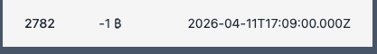</td>
    </tr>
    <tr>
        <td>Corrections</td>
        <td>Change service to grab price of pizza from database rather than trust user request</td>
    </tr>
</table>

 

<table>
    <tr>
        <th>Item</th>
        <th>Result</th>
    </tr>
    <tr>
        <td>Date</td>
        <td>April 11, 2026</td>
    </tr>
    <tr>
        <td>Target</td>
        <td>pizza.jonahlarsen.click</td>
    </tr>
    <tr>
        <td>Classification</td>
        <td>Identification and Authentication Failures</td>
    </tr>
    <tr>
        <td>Severity</td>
        <td>3</td>
    </tr>
    <tr>
        <td>Description</td>
        <td>Any user can delete a franchise because there is no check for authorization.</td>
    </tr>
    <tr>
        <td>Corrections</td>
        <td>Change Service to authenticate user and check their role before allowing franchise to be deleted</td>
    </tr>
</table>

 

<table>
    <tr>
        <th>Item</th>
        <th>Result</th>
    </tr>
    <tr>
        <td>Date</td>
        <td>April 11, 2026</td>
    </tr>
    <tr>
        <td>Target</td>
        <td>pizza.jonahlarsen.click</td>
    </tr>
    <tr>
        <td>Classification</td>
        <td>Identification and Authentication Failures</td>
    </tr>
    <tr>
        <td>Severity</td>
        <td>2</td>
    </tr>
    <tr>
        <td>Description</td>
        <td>Login is prone to brute force attacks, dictionary, rainbow, etc.</td>
    </tr>
    <tr>
        <td>Corrections</td>
        <td>
        Add a rate limiter for login requests so that brute force attacks can't be executed against production server
        </td>
    </tr>
</table>

 

<table>
    <tr>
        <th>Item</th>
        <th>Result</th>
    </tr>
    <tr>
        <td>Date</td>
        <td>April 11, 2026</td>
    </tr>
    <tr>
        <td>Target</td>
        <td>pizza.jonahlarsen.click</td>
    </tr>
    <tr>
        <td>Classification</td>
        <td>Broken Access Control</td>
    </tr>
    <tr>
        <td>Severity</td>
        <td>1</td>
    </tr>
    <tr>
        <td>Description</td>
        <td>Any user can obtain the list of all users with their emails and roles.</td>
    </tr>
    <tr>
        <td>Corrections</td>
        <td>Make listUsers check if the user is an admin before sending the list of users</td>
    </tr>
</table>

 

#### Maguire Self Attack

<table>
    <tr>
        <th>Item</th>
        <th>Result</th>
    </tr>
    <tr>
        <td>Date</td>
        <td>April 10, 2026</td>
    </tr>
    <tr>
        <td>Target</td>
        <td>pizza.maguireellsworthpizza.click</td>
    </tr>
    <tr>
        <td>Classification</td>
        <td>Broken Access Control</td>
    </tr>
    <tr>
        <td>Severity</td>
        <td>3</td>
    </tr>
    <tr>
        <td>Description</td>
        <td>Able to delete franchises without any authentication and low-privileged users</td>
    </tr>
    <tr>
        <td>Images</td>
        <td>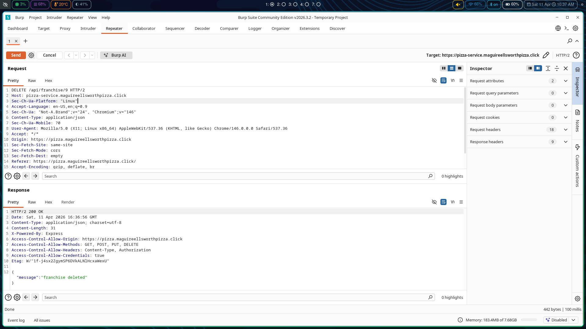</td>
    </tr>
    <tr>
        <td>Corrections</td>
        <td>Apply authentication middleware in /api/franchise/:id path and make sure that user has admin role.</td>
    </tr>
</table>

<table>
    <tr>
        <th>Item</th>
        <th>Result</th>
    </tr>
    <tr>
        <td>Date</td>
        <td>April 10, 2026</td>
    </tr>
    <tr>
        <td>Target</td>
        <td>pizza.maguireellsworthpizza.click</td>
    </tr>
    <tr>
        <td>Classification</td>
        <td>Injection</td>
    </tr>
    <tr>
        <td>Severity</td>
        <td>2</td>
    </tr>
    <tr>
        <td>Description</td>
        <td>SQL injection point present in update user logic.</td>
    </tr>
    <tr>
        <td>Images</td>
        <td>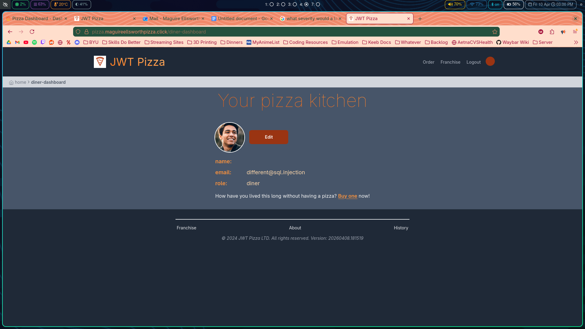</td>
    </tr>
    <tr>
        <td>Corrections</td>
        <td>Scrub input for potential injections and prevent stack errors from being sent to users</td>
    </tr>
</table>

<table>
    <tr>
        <th>Item</th>
        <th>Result</th>
    </tr>
    <tr>
        <td>Date</td>
        <td>April 10, 2026</td>
    </tr>
    <tr>
        <td>Target</td>
        <td>pizza.maguireellsworthpizza.click</td>
    </tr>
    <tr>
        <td>Classification</td>
        <td>Authentication Failure</td>
    </tr>
    <tr>
        <td>Severity</td>
        <td>3</td>
    </tr>
    <tr>
        <td>Description</td>
        <td>Any authenticated user can change the price and name of an item in an order even putting in negative numbers.</td>
    </tr>
    <tr>
        <td>Images</td>
        <td></td>
    </tr>
    <tr>
        <td>Corrections</td>
        <td>Before submitting an order, check to make sure, or even input correct item price.</td>
    </tr>
</table>

<table>
    <tr>
        <th>Item</th>
        <th>Result</th>
    </tr>
    <tr>
        <td>Date</td>
        <td>April 10, 2026</td>
    </tr>
    <tr>
        <td>Target</td>
        <td>pizza.maguireellsworthpizza.click</td>
    </tr>
    <tr>
        <td>Classification</td>
        <td>Broken Access Control</td>
    </tr>
    <tr>
        <td>Severity</td>
        <td>1</td>
    </tr>
    <tr>
        <td>Description</td>
        <td>Low-privileged users have access to a list of other user credentials like name, email, and role. A brute force attack could potentially get into an admin account.</td>
    </tr>
    <tr>
        <td>Images</td>
        <td>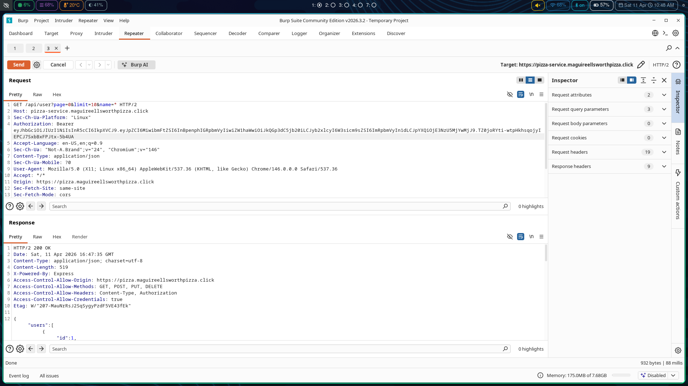</td>
    </tr>
    <tr>
        <td>Corrections</td>
        <td>Before requesting user information for the admin dashboard make sure the user has an admin role.</td>
    </tr>
</table>

<table>
    <tr>
        <th>Item</th>
        <th>Result</th>
    </tr>
    <tr>
        <td>Date</td>
        <td>April 10, 2026</td>
    </tr>
    <tr>
        <td>Target</td>
        <td>pizza.maguireellsworthpizza.click</td>
    </tr>
    <tr>
        <td>Classification</td>
        <td>Broken Access Control</td>
    </tr>
    <tr>
        <td>Severity</td>
        <td>3</td>
    </tr>
    <tr>
        <td>Description</td>
        <td>Able to send a request with an empty password and receive an admins token</td>
    </tr>
    <tr>
        <td>Images</td>
        <td>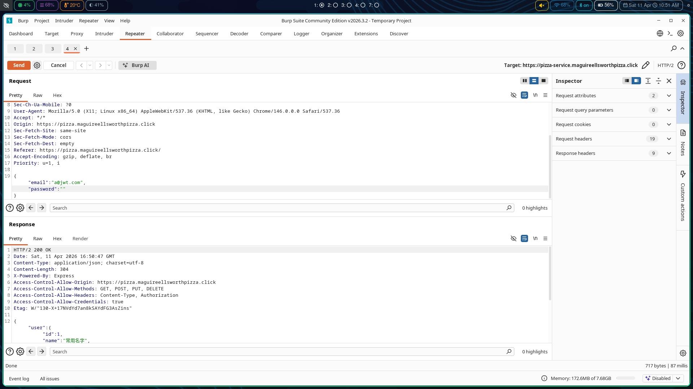</td>
    </tr>
    <tr>
        <td>Corrections</td>
        <td>Check to make sure that password is not empty before comparing it to encrypted password.</td>
    </tr>
</table>

<table>
    <tr>
        <th>Item</th>
        <th>Result</th>
    </tr>
    <tr>
        <td>Date</td>
        <td>April 10, 2026</td>
    </tr>
    <tr>
        <td>Target</td>
        <td>pizza.maguireellsworthpizza.click</td>
    </tr>
    <tr>
        <td>Classification</td>
        <td>Security Misconfiguration</td>
    </tr>
    <tr>
        <td>Severity</td>
        <td>3</td>
    </tr>
    <tr>
        <td>Description</td>
        <td>Default diner, franchise, and admin email and passwords are still present.</td>
    </tr>
    <tr>
        <td>Images</td>
        <td>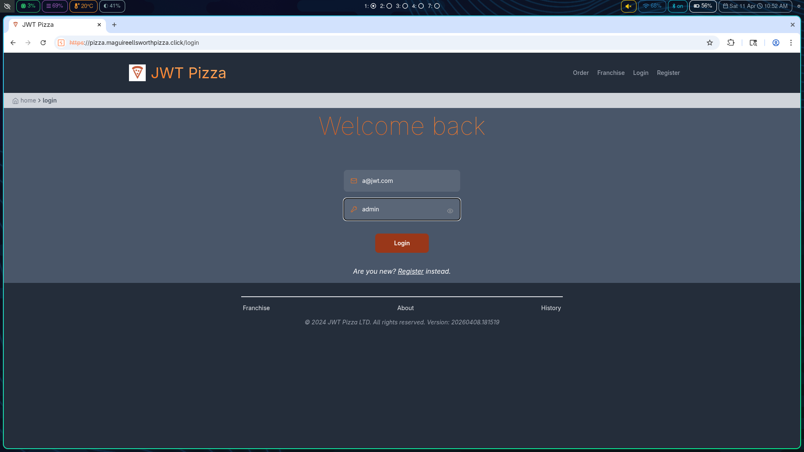</td>
    </tr>
    <tr>
        <td>Corrections</td>
        <td>Remove default account info from database.</td>
    </tr>
</table>

### Peer Attack

#### Jonah attack on Maguire

<table>
    <tr>
        <th>Item</th>
        <th>Result</th>
    </tr>
    <tr>
        <td>Date</td>
        <td>April 11, 2026</td>
    </tr>
    <tr>
        <td>Target</td>
        <td>pizza.maguireellsworthpizza.click</td>
    </tr>
    <tr>
        <td>Classification</td>
        <td>Authentication Failures</td>
    </tr>
    <tr>
        <td>Severity</td>
        <td>0</td>
    </tr>
    <tr>
        <td>Description</td>
        <td>Attempts to login without a password result in a 400 status.</td>
    </tr>
    <tr>
        <td>Corrections</td>
        <td>No correction needed it is already hardened.</td>
    </tr>
</table>

 

<table>
    <tr>
        <th>Item</th>
        <th>Result</th>
    </tr>
    <tr>
        <td>Date</td>
        <td>April 11, 2026</td>
    </tr>
    <tr>
        <td>Target</td>
        <td>pizza.maguireellsworthpizza.click</td>
    </tr>
    <tr>
        <td>Classification</td>
        <td>Injection</td>
    </tr>
    <tr>
        <td>Severity</td>
        <td>1</td>
    </tr>
    <tr>
        <td>Description</td>
        <td>Price of a pizza can be edited in the request, even to be negative</td>
    </tr>
    <tr>
        <td>Images</td>
        <td>
    </tr>
    <tr>
        <td>Corrections</td>
        <td>Change service to grab price of pizza from database rather than trust user request</td>
    </tr>
</table>

 

<table>
    <tr>
        <th>Item</th>
        <th>Result</th>
    </tr>
    <tr>
        <td>Date</td>
        <td>April 11, 2026</td>
    </tr>
    <tr>
        <td>Target</td>
        <td>pizza.maguireellsworthpizza.click</td>
    </tr>
    <tr>
        <td>Classification</td>
        <td>Identification and Authentication Failures</td>
    </tr>
    <tr>
        <td>Severity</td>
        <td>0</td>
    </tr>
    <tr>
        <td>Description</td>
        <td>Deleting a franchise checks for authentication and authorization</td>
    </tr>
    <tr>
        <td>Corrections</td>
        <td>No correction needed.</td>
    </tr>
</table>

 

<table>
    <tr>
        <th>Item</th>
        <th>Result</th>
    </tr>
    <tr>
        <td>Date</td>
        <td>April 11, 2026</td>
    </tr>
    <tr>
        <td>Target</td>
        <td>pizza.maguireellsworthpizza.click</td>
    </tr>
    <tr>
        <td>Classification</td>
        <td>Identification and Authentication Failures</td>
    </tr>
    <tr>
        <td>Severity</td>
        <td>2</td>
    </tr>
    <tr>
        <td>Description</td>
        <td>Login is prone to brute force attacks, dictionary, rainbow, etc.</td>
    </tr>
    <tr>
        <td>Corrections</td>
        <td>
        Add a rate limiter for login requests so that brute force attacks can't be executed against production server
        </td>
    </tr>
</table>

 

<table>
    <tr>
        <th>Item</th>
        <th>Result</th>
    </tr>
    <tr>
        <td>Date</td>
        <td>April 11, 2026</td>
    </tr>
    <tr>
        <td>Target</td>
        <td>pizza.maguireellsworthpizza.click</td>
    </tr>
    <tr>
        <td>Classification</td>
        <td>Broken Access Control</td>
    </tr>
    <tr>
        <td>Severity</td>
        <td>0</td>
    </tr>
    <tr>
        <td>Description</td>
        <td>It is hardened so that only an admin can list users.</td>
    </tr>
    <tr>
        <td>Corrections</td>
        <td>No correction needed.</td>
    </tr>
</table>

 

#### Maguire attack on Jonah

<table>
    <tr>
        <th>Item</th>
        <th>Result</th>
    </tr>
    <tr>
        <td>Date</td>
        <td>April 11, 2026</td>
    </tr>
    <tr>
        <td>Target</td>
        <td>pizza.jonahlarsen.click</td>
    </tr>
    <tr>
        <td>Classification</td>
        <td>Security Misconfiguration</td>
    </tr>
    <tr>
        <td>Severity</td>
        <td>3</td>
    </tr>
    <tr>
        <td>Description</td>
        <td>Default diner, franchise, and admin email and passwords are still present.</td>
    </tr>
    <tr>
        <td>Images</td>
        <td>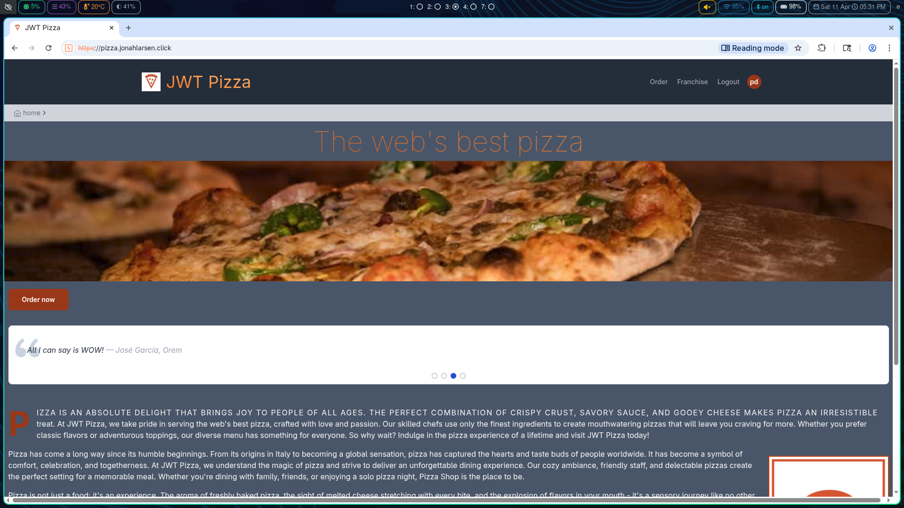</td>
    </tr>
    <tr>
        <td>Corrections</td>
        <td>Delete default accounts for diner, franchise, and admin.</td>
    </tr>
</table>

<table>
    <tr>
        <th>Item</th>
        <th>Result</th>
    </tr>
    <tr>
        <td>Date</td>
        <td>April 11, 2026</td>
    </tr>
    <tr>
        <td>Target</td>
        <td>pizza.jonahlarsen.click</td>
    </tr>
    <tr>
        <td>Classification</td>
        <td>Broken Access Control</td>
    </tr>
    <tr>
        <td>Severity</td>
        <td>0</td>
    </tr>
    <tr>
        <td>Description</td>
        <td>Could not delete franchise with out authorization or low-privileged user like a diner.</td>
    </tr>
    <tr>
        <td>Images</td>
        <td>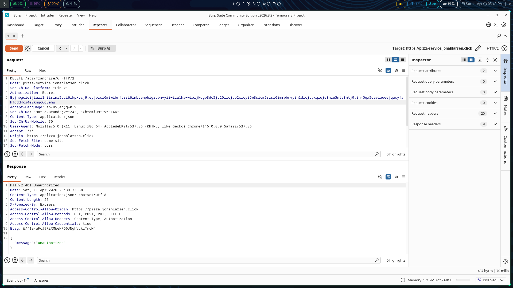</td>
    </tr>
    <tr>
        <td>Corrections</td>
        <td>No action needed</td>
    </tr>
</table>

<table>
    <tr>
        <th>Item</th>
        <th>Result</th>
    </tr>
    <tr>
        <td>Date</td>
        <td>April 11, 2026</td>
    </tr>
    <tr>
        <td>Target</td>
        <td>pizza.jonahlarsen.click</td>
    </tr>
    <tr>
        <td>Classification</td>
        <td>Injection</td>
    </tr>
    <tr>
        <td>Severity</td>
        <td>2</td>
    </tr>
    <tr>
        <td>Description</td>
        <td>Sql injection in the update user fields. Could potentially lock out users including admins if access to the account was obtained.</td>
    </tr>
    <tr>
        <td>Images</td>
        <td>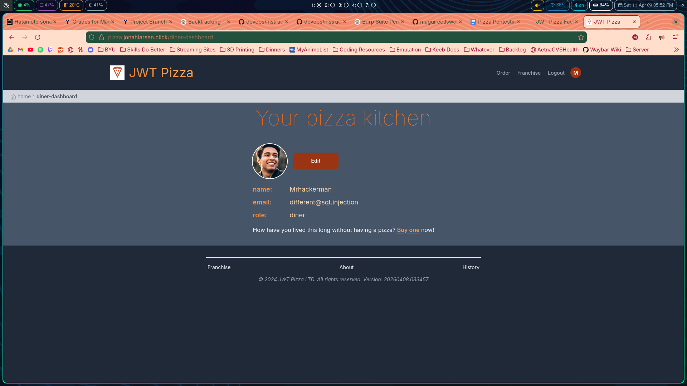</td>
    </tr>
    <tr>
        <td>Corrections</td>
        <td>Scrub input to make sure no sql injections are input. Or better form updateUser in database so no string concatenation.</td>
    </tr>
</table>

<table>
    <tr>
        <th>Item</th>
        <th>Result</th>
    </tr>
    <tr>
        <td>Date</td>
        <td>April 11, 2026</td>
    </tr>
    <tr>
        <td>Target</td>
        <td>pizza.jonahlarsen.click</td>
    </tr>
    <tr>
        <td>Classification</td>
        <td>Broken Access Control</td>
    </tr>
    <tr>
        <td>Severity</td>
        <td>2</td>
    </tr>
    <tr>
        <td>Description</td>
        <td>Any authenticated user can change the price and name of an item in an order even putting in negative numbers.</td>
    </tr>
    <tr>
        <td>Images</td>
        <td>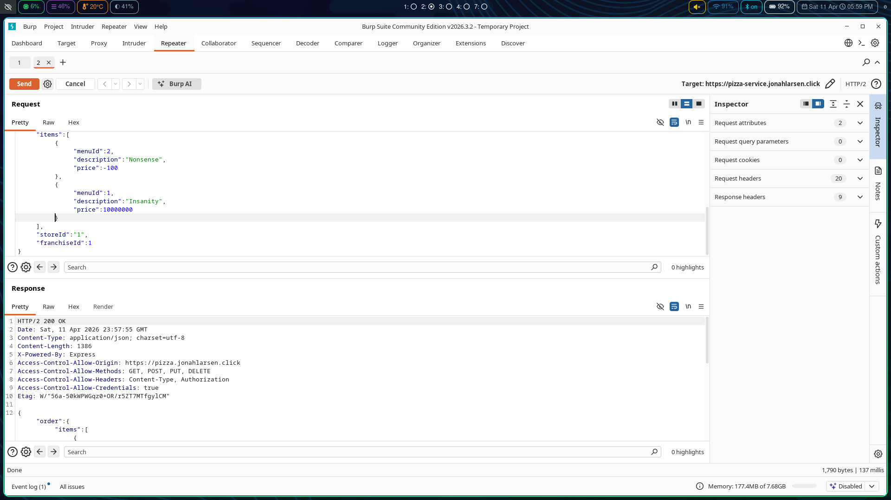</td>
    </tr>
    <tr>
        <td>Corrections</td>
        <td>Grab pizza information from database rather than relying on accurate info from the client</td>
    </tr>
</table>

<table>
    <tr>
        <th>Item</th>
        <th>Result</th>
    </tr>
    <tr>
        <td>Date</td>
        <td>April 11, 2026</td>
    </tr>
    <tr>
        <td>Target</td>
        <td>pizza.jonahlarsen.click</td>
    </tr>
    <tr>
        <td>Classification</td>
        <td>Broken Access Control</td>
    </tr>
    <tr>
        <td>Severity</td>
        <td>0</td>
    </tr>
    <tr>
        <td>Description</td>
        <td>Tried to access userlist from low-level user permissions and also no authorization.</td>
    </tr>
    <tr>
        <td>Images</td>
        <td>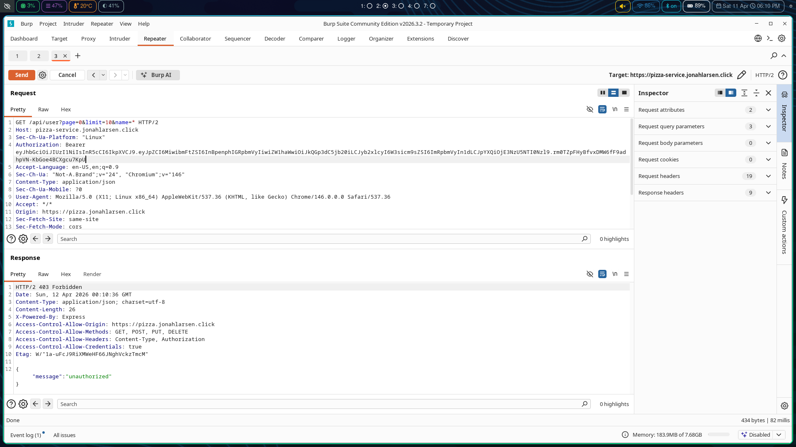</td>
    </tr>
    <tr>
        <td>Corrections</td>
        <td>No action required</td>
    </tr>
</table>

<table>
    <tr>
        <th>Item</th>
        <th>Result</th>
    </tr>
    <tr>
        <td>Date</td>
        <td>April 11, 2026</td>
    </tr>
    <tr>
        <td>Target</td>
        <td>pizza.jonahlarsen.click</td>
    </tr>
    <tr>
        <td>Classification</td>
        <td>Broken Access Control</td>
    </tr>
    <tr>
        <td>Severity</td>
        <td>0</td>
    </tr>
    <tr>
        <td>Description</td>
        <td>Tried to receive a valid token with a request with an empty password field but recieved 404 error.</td>
    </tr>
    <tr>
        <td>Images</td>
        <td>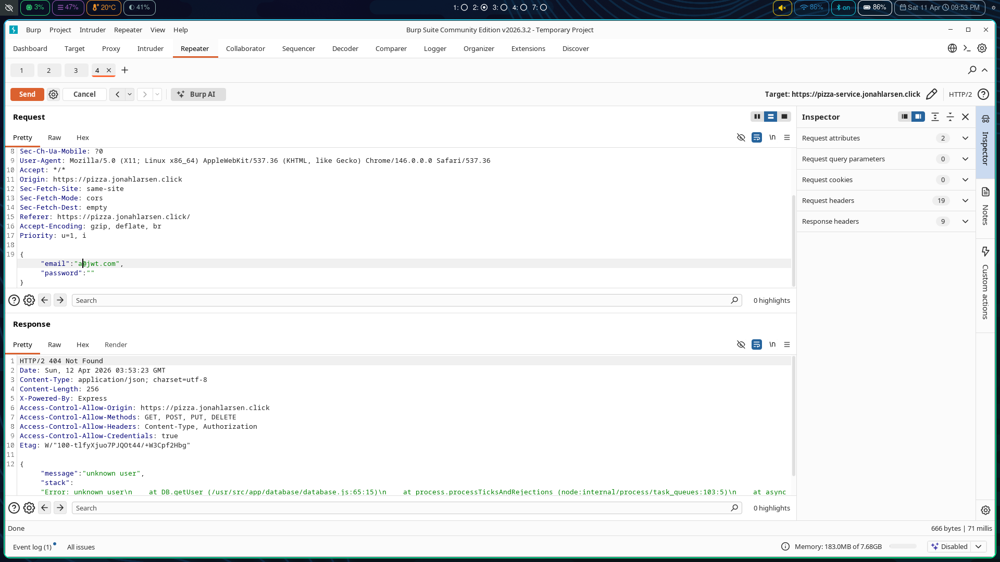</td>
    </tr>
    <tr>
        <td>Corrections</td>
        <td>No action required</td>
    </tr>
</table>

### Summary

We learned a lot about looking for attacks and how difficult it would be if you didn't have the source code or if default accounts for all levels were not present. Most of our attacks were found by looking at the source code. Requests that sent data to the back end were also a good source of attack vectors and you couldn't trust anything that was sent by a user. On the back end multiple scrubs of the data were needed like password lengths and easily verifiable data like stuff stored in the database. We also didn't realize how hard it was to keep the different authorization levels seperate and not able to access the things they shouldn't. We used the same checks as some of the other endpoints like the check to see if a user is an admin or not and sending back an error if they were not. Sql injection is also very prone to happen without proper query construction. You have to use the provided syntax with the question mark to input the values provided.

Modern day tools such as BurpSuite make attacking the internet widely available and when people are motivated they will try anything. Attacks are always going on as we can see in our grafana metrics and logs and eventually something will land and they can wreck havoc on your website. We used only a few of the tools available to us because of our limited experience but others who know what they are doing could potentially do much worse than us. 